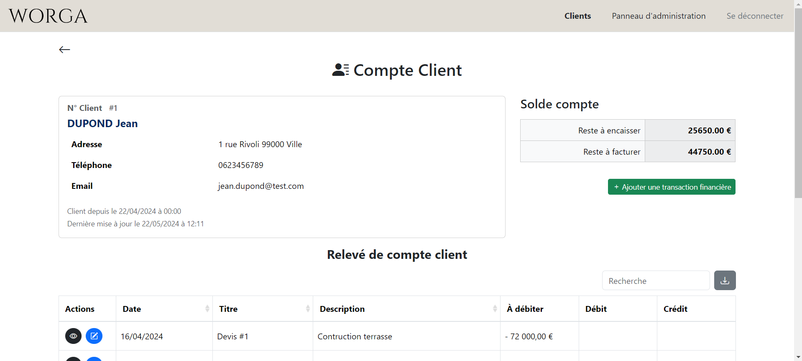
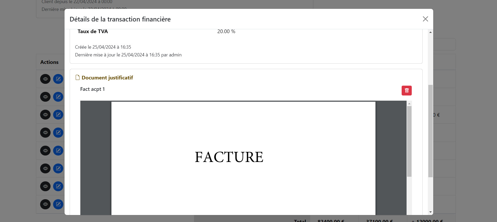

# Worga

Worga est une application web de gestion de comptes client, un CRM (Client Relationship Management) simple et intuitif. Elle permet d'éditer des fiches clients et de gérer les relevés de compte client. Elle suit une architecture MVC (Modèle, Vue, Controleur) et est construite en HTML, CSS, JavaScript et PHP. La base de données utilise MySQL. Pour un rendu optimal et un design responsive, Worga utilise le moteur de template Twig et le framework CSS Bootstrap.

## Prise en main

Ces instructions vous permettront de mettre en place une copie du projet.

### Prérequis

Pour installer le projet, vous devez avoir les outils suivants :

- Serveur web : Apache 2.4.53 et PHP 8.2.13
- Base de données : MySQL 8.0.27
- Composer : 2.4.4

### Installation

Suivez ces étapes pour configurer le projet :

1. Clonez ce dépôt sur votre machine :

    ```bash
    git clone https://github.com/BeaMoura0906/Worga.git
    cd Worga
    ```

2. Lancez le serveur web.

3. Configurez la base de données :

    Veuillez importer le fichier `db\worga.sql` dans votre base de données.

    Si la base de données se trouve sur un serveur distant, vous pouvez utiliser un fichier `.env` à placer à la racine du projet pour la configurer la connexion à celle-ci, tel que :

    ```bash 
    DB_HOST=dbhostexample
    DB_NAME=dbnameexample
    DB_LOGIN=dbloginexample
    DB_PASSWORD=dbpasswordexample
    ```

4. Lancez l'application :

    Pour cela, veuillez ouvrir votre navigateur et placez-vous dans le dossier `Worga` à l'aide du cheminement de votre projet au sein du serveur. 

## Utilisation

Veuillez ouvrir votre navigateur et placez-vous dans le dossier `Worga` à l'aide du cheminement de votre projet au sein du serveur.

1. Page d'accueil


2. Page de connexion


3. Tableau de bord contenant les fiches clients


4. Page d'ajout/modification d'une fiche client


5. Page d'un compte client avec le relevé de compte client



6. Popup d'ajout/modification d'une transaction financière du compte client


7. Popup de visualisation des détails d'une transaction financière avec la possibilité de l'associer à un document justificatif



8. Exportation du relevé de compte client en PDF


9. Panneau d'administration


10. Page de création/modification d'un utilisateur


N'hésitez pas à consulter le dossier `screenshots` pour plus de captures d'écran de l'application, notamment pour visualizer le design responsive.

## Tests

Un plan de tests fonctionnels est disponible dans le fichier `tests\functional\Worga_FunctionalTest.pdf`, retraçant les tests effectués pour chaque fonctionnalité.

## Documentation

Veuillez consulter la documentation de Worga dans le dossier `docs`. Vous y trouverez :

- Le cahier des charges (contexte, spécifications fonctionnelles et techniques, diagrammes de cas d'utilisation et de séquences, arborescence des pages, maquette de la page de relevé de compte client) : `docs\Worga_RequirementsDocument.pdf`.
- Les MCD (Modéle de Conception de Données), MLD (Modéle Logiciel de Données) et schéma E-R (Schéma de Relation Entité-Association) : `docs\diagrams\CDM.png`, `docs\diagrams\LDM.png` et `docs\diagrams\ERD.png`, .
- La documentation de classes PHP : `docs\phpdoc\`. Pour y accéder, ouvrez le fichier `docs\phpdoc\index.html` dans votre navigateur. 

## Auteur

Beatriz Moura - Développement initial | GitHub : @BeaMoura0906

Ce projet a été réalisé dans le cadre de l'UE 5 "Conception et développement d'applications" du BTS SIO (Services Informatiques aux Organisations) option SLAM (Solutions Logicielles et Applications Métiers). 

E5 : Réalisation n° 1 | 18 juin 2024
